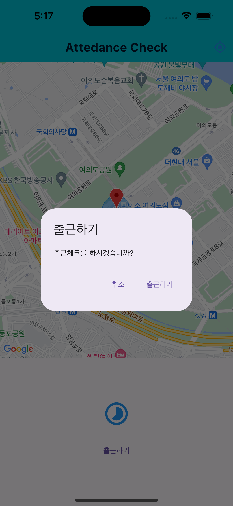

# attendance_check

##Create a simple location-based service using Google Maps

- Setting up and using Google Maps
- Show your location on a map using location services
- Find the distance between specific locations
- Show markers on a map
- Show a circle on a map
- Move the camera to a specific location
- Utilizing the Material Dialog

  
