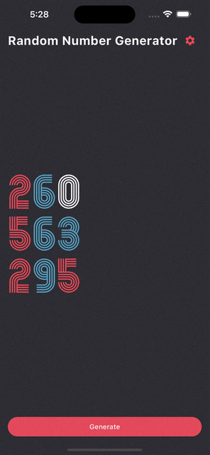

# random_number_generator

## Create an app that generates 3 random numbers below a specified number every time a button is pressed

- Generate Random Numbers
- Simple navigation and sending and receiving data
- Using the Slider Widget
- Rendering Widgets and Organizing Code Using Functional Programming

```
Row(
                        children: 123
                            .toString()
                            .split('')
                            .map((x) => Image.asset(
                                  'asset/img/$x.png',
                                  height: 70.0,
                                  width: 50.0,
                                ))
                            .toList(),
                      ),
->
children: [
                      123,
                      456,
                      789,
                    ]
                        .map(
                          (x) => Row(
                            children: x
                                .toString()
                                .split('')
                                .map(
                                  (y) => Image.asset(
                                    'asset/img/$y.png',
                                    height: 70.0,
                                    width: 50.0,
                                  ),
                                )
                                .toList(),
                          ),
                        )
                        .toList(),

-> // padding
children: [
                      123,
                      456,
                      789,
                    ]
                        .asMap()
                        .entries
                        .map(
                          (x) => Padding(
                            padding:
                                EdgeInsets.only(bottom: x.key == 2 ? 0 : 16.0),
                            child: Row(
                              children: x.value
                                  .toString()
                                  .split('')
                                  .map(
                                    (y) => Image.asset(
                                      'asset/img/$y.png',
                                      height: 70.0,
                                      width: 50.0,
                                    ),
                                  )
                                  .toList(),
                            ),
                          ),
                        )
                        .toList(),
```


